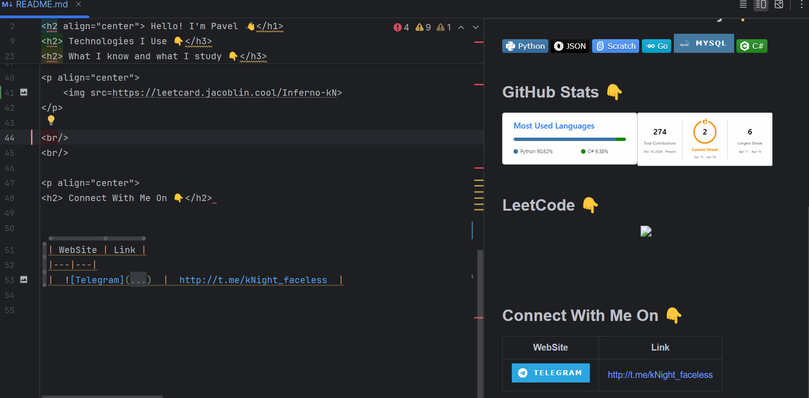

 
<h2 align="center"> Hello! I'm Pavel 👋</h1>

<samp> I am a beginner Python programmer, 💻 • 🛠 I enjoy create projects and learn something new. 🌱.</samp>

 
 

<h2> Technologies I Use 👇</h3>

 

### 🚀 Pet Projects👇
-  [Doodle Jump] https://github.com/Inferno-kN/DoodleJump2 - The Little Alien is an arcade action platformer with a side view. In the game, you need to climb as high as possible in an area similar to a sheet of a notebook in a cage, constantly jumping from one platform to another

<h2> What I know and what I study 👇</h3>

<h2> GitHub Stats 👇</h2> 

 

<h2> LeetCode 👇</h2> 

    

    

 
 
 

<h2> Connect With Me On 👇</h2>

| WebSite | Link |
|---|---|
|    |  http://t.me/kNight_faceless  |

